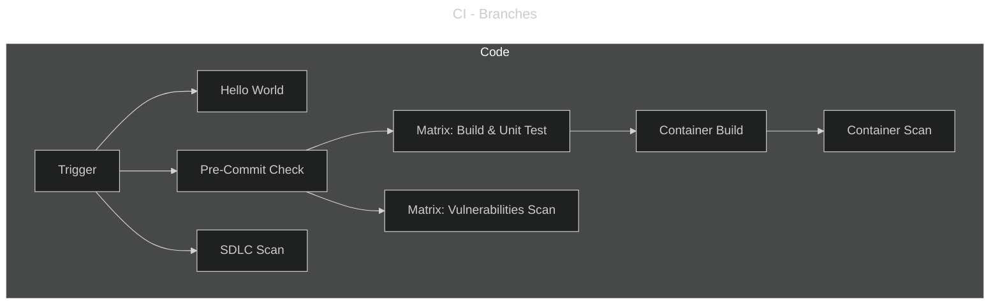

---
hide:
  - toc
---

# Branches Pipeline

The **Branches Pipeline** (`CI - Branches`) provides early feedback during development by running on feature and development branches.  This workflow is mostly aimed at pre-validation during the initial phase of development (before PR is initiatied); in the event of test or scan failure the workflow continues.

**Trigger Conditions:**

```yaml
on:
  push:
    branches:
      - demo/*
      - dev
      - feat/*
      - fix/*
      - rel/*
    paths-ignore:
      - 'README.md'
  workflow_dispatch:
```

The detailed stages of the `branch` workflows are as following:



## Jobs Overview

This lightweight approach provides fast feedback while reserving full validation for pull requests and main branch merges.

### Hello World

Calls a reusable workflow from the organization's shared workflows repository for validation.

### SDLC Scan

If required, implement the necessary steps to enable Software Development Lifecycle Scan in the phase.

```yaml
  - name: Run SDLC Scan
    id: sdlc
    run: |
      echo Run SDLC Scan
      echo "::warning::Must implement a SDLC scan mechanism."
    shell: bash
```

### Pre-Commit Check

Run check for linting, formatting, and code quality checks.  This steps ensure within certains restriction that developpers have setup the `pre-commit` framework.

```yaml
  - name: Run Pre-Commit Checks
    id: precommit
    uses: ./.github/actions/precommit
    with:
      skip: "pytest, uv-export"
    continue-on-error: true
```

Runs pre-commit check with `continue-on-error: true` to provide feedback without blocking development.

### Build & Unit Test

Build the codebase and run all test except the `e2e` suite for performance purpose.    This matrix steps runs on `ubuntu-24.04` with `python3.10`.

```yaml
  - name: Pytest - Run Unit Test
    id: test
    run: |
      uv pip install pytest pytest-cov pytest-django pytest-mock pytest-xdist
      uv run pytest -m "not e2e"
    shell: bash
    continue-on-error: true
```

Runs build and unit test with `continue-on-error: true` to provide feedback without blocking development.

### Vulnerability Scan

If required, implement the necessary steps to enable SAST and SCA Scan in the phase.
This matrix steps runs on both `ubuntu-24.04` and `ubuntu-24.04-arm`.

```yaml
  - name: Run SAST
    id: sast
    run: |
      echo Run SAST
      echo "::warning::Must implement a code scanning mechanism."
    shell: bash

  - name: Run SCA
    id: sca
    run: |
      echo Run SCA
      echo "::warning::Must implement a dependencies scanning mechanism."
    shell: bash
```

### Container Build

Package the container binary image as a docker container **without pushing** to registry using a composite actions.

```yaml
  - name: Build Docker Image
    id: docker
    uses: ./.github/actions/docker
    with:
      token: ${{ secrets.GITHUB_TOKEN }}
      push: false
```

### Container Scan

If required, implement the necessary steps to enable Container Scan in the phase.

```yaml
  - name: Run Container Scan
    id: container
    run: |
      echo Run Container Scan
      echo "::warning::Must implement a container scanning mechanism."
    shell: bash
```
