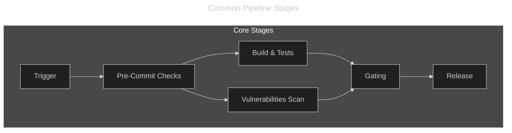

---
hide:
  - toc
---

# Pipeline Overview

The **Insecure Bank Corp** project uses GitHub Actions for CI|CD platform. The pipeline is designed to ensure code quality, security, and reliable deployments through multiple stages of validation.

The CI/CD strategy follows a **branch-based workflow** with four distinct pipelines triggered by different Git events:

| Pipeline      | Trigger                      | Description                                         | Status                                                                                                                                                                                                                                      |
|---------------|------------------------------|-----------------------------------------------------|---------------------------------------------------------------------------------------------------------------------------------------------------------------------------------------------------------------------------------------------|
| CI - Branches | Push to various branches     | Early feedback during development                   | [](https://github.com/mighty-muffin/insecure-bank-corp/actions/workflows/branch.yml)                                            |
| CI - PR       | PR to `main`                 | Comprehensive validation before merge               | [](https://github.com/mighty-muffin/insecure-bank-corp/actions/workflows/pr.yml)                                                          |
| CI - Main     | Push to `main` branch        | Full validation, container build & publish, release | [](https://github.com/mighty-muffin/insecure-bank-corp/actions/workflows/main.yml)                                                    |
| CI - Tag      | Version tags (`v*`)          | Semantic release and changelog publication          | [](https://github.com/mighty-muffin/insecure-bank-corp/actions/workflows/tag.yml)                                                       |
| Dependabot    | Weekly (7 days cooldown)     | Regular updates for dependencies                    | [](https://github.com/mighty-muffin/insecure-bank-corp/actions/workflows/dependabot/dependabot-updates) |

Most pipelines shares these core stages:



At a high level, once a git commit is pushed to the remote repository the various triggers different actions:

- **Pre-Commit:** Check for linting, formatting, and code quality checks
- **Build Phase:** Run the build, test and container packaging
- **Security Phase:** Run the SDLC, Secret, SAST, SCA and Container scanning
- **Gating Phase:** Check if any failure occurs during the Security Phase
- **Release Phase:** Trigger the package release once code is merged to `main`

## Reusable Workflows and Composite Actions

**Reusable Workflows** create a level of abstraction in the workflow definition allowing easier governance at scale.
**Composite Actions** simplify complexe and compressed multi-steps operations into a single block.

```yml
# ...
  hello:
    name: Call Hello World Reusable Workflow
    uses: mighty-muffin/.github/.github/workflows/reusable-hello-world.yml@main
#...
  pre-commit:
    steps:
      - name: Run Pre-Commit Checks
        id: precommit
        uses: ./.github/actions/precommit
        with:
          skip: "pytest, uv-export"
        continue-on-error: true
# ...
```

## Concurrency Control

All pipelines implement concurrency control to prevent duplicate runs.  This ensures only the latest commit is processed when multiple pushes occur in quick succession.

```yml
concurrency:
  group: ${{ github.workflow }}-${{ github.head_ref || github.run_id }}
  cancel-in-progress: true
```

## Build Platform

This project leverage both `amd64` and `arm64` build agent to ensure compatibility accros numerous computer platforms.

```yml
job_name:
  needs:
    - <required-steps>
  name: <Job Name>
  runs-on: ${{ matrix.os }}
  strategy:
    fail-fast: false
    matrix:
      os: [ubuntu-24.04, ubuntu-24.04-arm]
  timeout-minutes: 10
```
